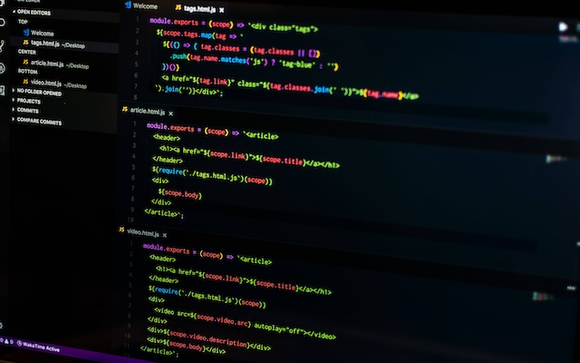
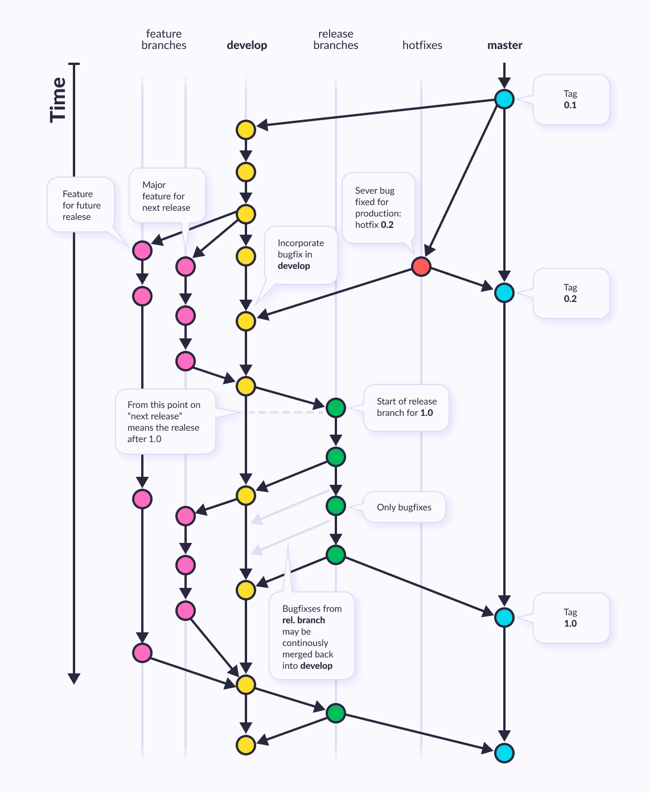
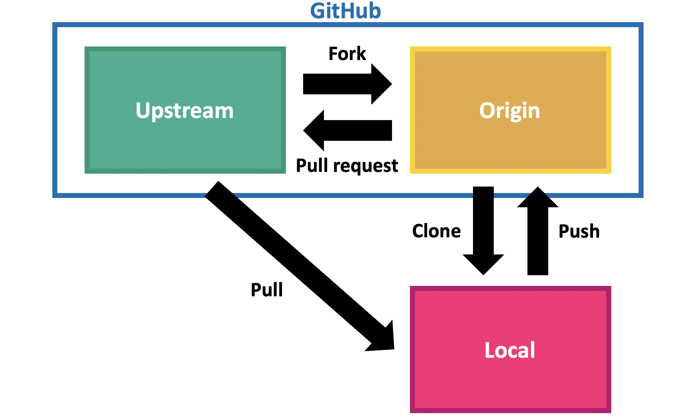

<!-- 
_class: front
_paginate: false
_footer: |
    
    
    
-->

# Front End Web Developer

## Módulo 1 :: Desarrollo web y gestión de proyectos

Profesor: Saverio Trioni

> Convocatoria de 2023 de los Programas de formación profesional para el empleo, de
> especialidades de la oferta de formación no formal, para personas trabajadoras ocupadas,
> que promueve el Consorcio para la Formación Continua de Cataluña (ref. BDNS 709943)

--------------------------------------------------------------------------------

# Índice

1. Introducción a `git`
2. Introducción a GitHub
3. Visual Studio Code
4. Ramas y pull requests
5. Colaboración en GitHub
6. Conceptos avanzados de `git`
7. Conceptos avanzados de GitHub
8. Conceptos avanzados de Visual Studio Code
9. Preguntas

--------------------------------------------------------------------------------

<!--
_class: chapter-front
_paginate: false
header: Introducción a git
-->


# Introducción a git

--------------------------------------------------------------------------------

## ¿Qué es `git`?

`git` es un sistema de control de versiones distribuido, libre y de código abierto,
diseñado para manejar todo, desde proyectos pequeños hasta muy grandes, con velocidad
y eficiencia.

Un sistema de control de versiones (VCS) es una herramienta que registra los cambios
en un archivo o conjunto de archivos a lo largo del tiempo, de modo que puedas
recuperar versiones específicas más adelante.

`git` piensa en los datos más como un conjunto de instantáneas de un mini sistema de
archivos. Cada vez que confirmas un cambio, o guardas el estado de tu proyecto en
`git`, básicamente toma una foto del aspecto de todos tus archivos en ese momento y
guarda una referencia a esa instantánea.

--------------------------------------------------------------------------------

## ¿Por qué `git`?

**Control de versiones**: `git` mantiene un historial de cambios en el código
fuente, de manera que se pueden recuperar versiones anteriores de cualquier archivo.

**Colaboración**: `git` permite trabajar en equipo, con la posibilidad de
fusionar cambios de diferentes desarrolladores.

**Ramas**: `git` permite trabajar en diferentes versiones del código fuente en
paralelo, de manera que se pueden desarrollar nuevas funcionalidades sin afectar
la versión estable o el trabajo de otros desarrolladores.

--------------------------------------------------------------------------------

## ¿Cómo usamos `git`?

Hay tres maneras principales de usar `git`:

**Interfaz de línea de comandos**: `git` es una herramienta de línea de comandos,
   y la forma más común de usarlo es a través de la terminal.

**Interfaz gráfica de usuario**: hay varias aplicaciones que ofrecen una
   interfaz gráfica para `git`, como GitHub Desktop, Sourcetree, o GitKraken.
   Visual Studio Code también incluye soporte para `git`, desde un soporte básico
   ya preinstalado, hasta una funcionalidad muy avanzada con extensiones como GitLens.

**Plataformas de desarrollo colaborativo**: GitHub, GitLab, Bitbucket, y otras
   webs hospedan proyectos `git` y ofrecen herramientas para modificar y colaborar
   directamente en la web.

--------------------------------------------------------------------------------

## Practicamos con `git`

1. Abrir una terminal de línea de comandos. En Windows, se puede usar "Command Prompt"
   o "Windows Terminal". En macOS, se puede usar "Terminal". En Linux, se puede usar
   "Terminal" o "Konsole".
2. Ejecutar el comando `git --version` para comprobar que `git` está instalado.
3. Ejecutar el comando `git config --global user.name "Tu Nombre"` para configurar
   el nombre de usuario.
4. Ejecutar el comando `git config --global user.email "tudireccion@de.email"` para
   configurar la dirección de correo electrónico.
5. Ejecutar el comando `git config -l` para comprobar la configuración.
6. Ejecutar `git help` para obtener ayuda sobre los comandos de `git`.

Exploramos libremente la ayuda de `git` y los comandos básicos.

--------------------------------------------------------------------------------

<!--
header: Introducción a GitHub
_class: chapter-front
_paginate: false
-->


# Introducción a GitHub

--------------------------------------------------------------------------------

## ¿Qué es GitHub?

GitHub es una plataforma de desarrollo colaborativo para alojar proyectos
utilizando el sistema de control de versiones `git`.

> <https://github.com>

Permite a los desarrolladores trabajar juntos en proyectos desde cualquier lugar.

Permite proyectos privados y públicos, y la mayoría de las funcionalidades son
gratuitas.

Incluye herramientas para la gestión de proyectos, seguimiento de problemas, y
wikis de documentación.

Incluye tambien un editor de código en línea, con casi las mismas funcionalidades
que Visual Studio Code.

--------------------------------------------------------------------------------

## Practicamos con GitHub - interfaz web

1. Crear una cuenta en GitHub.
2. Crear un nuevo repositorio.
3. Crear un fichero `README.md` con el contenido `# Hola, mundo!`.
4. Crear una carpeta en el repositorio llamada `src`.
5. Crear un fichero `index.html` en la carpeta `src` con el contenido

   ```html
   <!DOCTYPE html>
   <html>
   <head>
       <title>Hola, mundo!</title>
   </head>
   <body>
       <h1>Hola, mundo!</h1>
   </body>
   </html>
   ```

Observamos la secuencia de cambios en el repositorio.

--------------------------------------------------------------------------------

## Practicamos con GitHub - editor de código en línea

1. Entrar en el editor de código en línea de GitHub: pulsar la tecla `.`
2. Modificar varios ficheros y carpetas
3. Preparar una _entrega_ de los cambios (en terminología `git`, preparamos un _commit_)
4. Escribir un mensaje de _entrega_ (en terminología `git`, escribimos un _commit message_)
5. Realizar la _entrega_ (en terminología `git`, realizamos un _commit_)

Observamos la secuencia de cambios en el repositorio.

**Nota**: A partir de este momento utilizaremos el vocabulario inglés de `git` y GitHub.

--------------------------------------------------------------------------------

<!--
header: Visual Studio Code
_class: chapter-front
_paginate: false
-->


# Visual Studio Code

--------------------------------------------------------------------------------

## ¿Qué es Visual Studio Code?

Visual Studio Code es un editor de código fuente desarrollado por Microsoft para
las plataformas Windows, Linux y macOS. Es gratuito y de código abierto.

> <https://code.visualstudio.com>

Incluye soporte para prácticamente cualquier lenguaje de programación, y se integra
con `git` y GitHub.

Incluye un sistema de extensiones que permite añadir funcionalidades adicionales.
Las extensiones recomendadas para este curso incluyen:

- GitLens: para interactuar con el sistema de control de versiones `git`.
- EditorConfig for VS Code: para mantener un estilo de código consistente.
- Prettier: para formatear el código automáticamente.
- ESLint: para detectar errores y problemas de estilo en el código JavaScript.
- Live Server: para visualizar el código HTML en un navegador web.

--------------------------------------------------------------------------------

## Configuración de Visual Studio Code

Visual Studio Code (o, más comúnmente, VS Code, o simplemente Code) se puede
configurar a través de la interfaz gráfica de usuario, de forma muy fácil.

Abrimos la configuración de VS Code utilizando la combinación de teclas `Ctrl` + `,`
(en macOS `Cmd` + `,`). Esta interfaz de usuario nos permite configurar muchas
opciones de VS Code, incluyendo la apariencia, el comportamiento, y las extensiones.

En la configuración de VS Code, podemos buscar cualquier opción utilizando el campo de búsqueda.

Configuramos las siguientes opciones:

- `editor.formatOnSave`: `true`
- `editor.rulers`: `[80, 120]`
- `files.autoSave`: `onFocusChange`

Escogemos un tema de color y un tema de iconos.

Configuramos Code para que tenga la interfaz en **inglés**.

--------------------------------------------------------------------------------

## Practicamos con Visual Studio Code

**Nota**: No utilizamos espacios ni diacríticos en los nombres de los ficheros y
carpetas.

1. Creamos una carpeta para un proyecto nuevo
2. Abrimos Visual Studio Code
3. Abrimos la carpeta del proyecto como un workspace
4. Creamos ficheros y carpetas
5. Utilizamos dos paneles para ver dos ficheros al mismo tiempo
6. Utilizamos el terminal integrado para ejecutar comandos de `git`

--------------------------------------------------------------------------------

## Practicamos con Visual Studio Code - GitHub

En la vista inicial de una ventana de Code, elegimos la opción de "Clone Git Repository…".

Conectamos nuestra cuenta de github.com a Code siguiendo las instrucciones, y
elegimos el repositorio que hemos creado en la práctica anterior.

Los ficheros del repositorio aparecerán en la vista de explorador de Code, y
podremos ver el historial de cambios en la vista de control de versiones.

Activamos la extensión GitLens y exploramos las funcionalidades que ofrece:

- anotaciones de línea
- historial de cambios

--------------------------------------------------------------------------------

## Practicamos con Visual Studio Code - GitHub (cont.)

Modificamos los ficheros del repositorio y observamos cómo los cambios se reflejan
en el panel de control de versiones.

Ejecutamos `git status` en el terminal integrado para comprobar el estado del
repositorio y comparamos con lo que podemos observar en el panel de control de
versiones.

Preparamos un commit, a través del panel de control de versiones, añadiendo los
ficheros modificados a la _staging area_.

Ejecutamos otra vez `git status` en el terminal integrado, comparamos el output.

Escribimos un mensaje de commit y realizamos el commit, y subsecuentemente pulsamos
el botón de sincronización en el panel de control de versiones.

Veridicamos en la web de GitHub que los cambios se han subido correctamente.

--------------------------------------------------------------------------------

## Practicamos con Visual Studio Code - Live Server

Instalamos la extensión Live Server.

Abrimos el fichero `index.html` y pulsamos el botón "Go Live" en la esquina inferior
derecha de la ventana de Code.

El navegador web se abrirá automáticamente con la página `index.html` cargada.

Modificamos el fichero `index.html` y observamos cómo los cambios se reflejan
automáticamente en el navegador.

--------------------------------------------------------------------------------

<!--
header: Ramas y pull requests
_class: chapter-front
_paginate: false
-->



# Ramas y pull requests

--------------------------------------------------------------------------------

## Ramas

Una rama (_branch_) en `git` es una línea de desarrollo independiente. Cada rama
es una secuencia de cambios en los ficheros del proyecto.

La rama principal de un proyecto `git` se llama `main`. Las ramas
secundarias se crean a partir de la rama principal, y se pueden fusionar de
nuevo en la rama principal.

Al utilizar ramas, se pueden desarrollar nuevas funcionalidades sin afectar la
rama principal, y se pueden realizar pruebas y experimentos sin riesgo.

También se pueden "traer" cambios recientes de la rama principal a una rama
secundaria, para mantenerla actualizada.

Al ser _rama_ una traducción muy apropiada de _branch_, podemos utilizar ambos
términos indistintamente, sin temor a confusión.

--------------------------------------------------------------------------------

## Practicamos las ramas

Las ramas se pueden crear y gestionar a través de la interfaz de línea de comandos
y a través de las herramientas interactivas en GitHub y en VS Code.

1. Creamos una rama secundaria en el repositorio de GitHub: abrimos el desplegable
   de la rama principal y escribimos el nombre para una nueva rama, y confimamos
   la creación.

2. En la nueva rama, creamos un fichero `license.md` con el contenido de una
   licencia de software libre, como la licencia MIT.

3. Realizamos un commit con el mensaje "Añadida licencia MIT".

4. Nos movemos a la rama principal y observamos que el fichero `license.md` no
   está presente.

5. Volvemos a la rama secundaria y observamos que el fichero `license.md` está
   presente.

6. Entramos en el editor online e interactuamos con las ramas desde allí.

--------------------------------------------------------------------------------

## Practicamos las ramas a través de la interfaz de línea de comandos

Si abrimos VS Code en la carpeta del proyecto, podemos abrir un terminal integrado
y ejecutar comandos de `git` directamente.

1. Ejecutamos `git fetch` para traer todos los cambios de github.com al repositorio
   local.

2. Ejecutamos `git branch` para ver todas las ramas del repositorio.

3. Ejecutamos `git switch <nombre de la rama>` para cambiar de rama.

4. Ejecutamos `git switch -` para volver a la rama anterior.

5. Ejecutamos `git switch --create <nombre de otra rama>` para crear una rama nueva
   y cambiar a ella.

--------------------------------------------------------------------------------

## Practicamos las ramas a través de la interfaz de línea de comandos (2)

1. Creamos otro fichero "acknowledments.md" en la rama secundaria, añadiendo un
   agradecimiento a los colaboradores del proyecto.

2. Añadimos el fichero a la _staging area_ con `git add acknowledgments.md`.

3. Realizamos un commit `git commit --message "Añadidos agradecimientos"`.

4. Preliminarmente, configuramos `git` para que utilice los nombres de las ramas
   locales cuando crea ramas en GitHub: `git config --global push.default current`.

5. Subimos la rama secundaria a GitHub con `git push --set-upstream origin <nombre de la rama>`.

A partir de este momento las dos ramans (en el ordenador y en GitHub) están
ligadas entre si y se pueden sincronizar simplemente con `git push` y `git pull`.

--------------------------------------------------------------------------------

## Pull requests

Una _pull request_ es una petición para fusionar una rama secundaria en la rama
principal. Es un concepto específico de cierta manera de utilizar `git`, y es la
base del flujo de trabajo en GitHub.

En un projecto en solitario, ramas y pull requests son una manera de mantener y de
desarrollar ideas independientes, pudiendo revisar de un vistazo los cambios
entre la rama secundaria y la rama principal.

En un proyecto colaborativo, las pull requests son una manera de colaborar con otras
personas, revisar y discutir los cambios, y asegurarse de que los cambios no
introducen errores o problemas.

--------------------------------------------------------------------------------

## Practicamos las pull requests

Desde la interfaz web de GitHub, creamos una pull request para fusionar la rama
secundaria en la rama principal: abrimos la pestaña "Pull requests" y pulsamos
el botón "New pull request".

Seleccionamos la rama secundaria como la rama que queremos fusionar, y la rama
principal como la rama en la que queremos fusionar.

Ya podemos previsualizar los cambios que se van a fusionar, y escribir un mensaje
para la pull request.

--------------------------------------------------------------------------------

## Practicamos las pull requests (2)

Una vez creada la pull request, añadimos comentarios:

- a líneas específicas modificadas: pulsando una icona `+` a la izquierda de la linea
- a grupos de líneas: arrastrando pulsando sobre los números de varias líneas, y
  pulsando el botón `+` que aparece al lado de la última línea seleccionada
- a ficheros enteros, pulsando el botón 💬 en el encabezado de fichero

En un comentario de línea o de grupo, pulsamos el botón "Add a suggestion" para
proponer una alternativa a las líneas seleccionadas.

Al terminar de comentar, pulsamos el desplegable "Review changes", añadimos un
mensaje general y elegimos "Comment" (ya que es un proyecto en solitario, no se
prevén aprobaciones).

--------------------------------------------------------------------------------

## Practicamos las pull requests (3)

En la página principal de la pull request (que corresponde a la pestaña "Conversation"), podemos ver todos los comentarios y las sugerencias.

Aceptamos una sugerencia pulsando el botón "Apply suggestion" en el comentario correspondiente, se creará un commit con los cambios sugeridos.

Seguimos modificando la rama añadiendo más cambios, usaremos el editor online para
hacerlo.

Finalmente damos por finalizado el trabajo en la rama secundaria y fusionamos la
rama en la rama principal, pulsando el botón "Merge pull request".

--------------------------------------------------------------------------------

<!--
header: Colaboración en GitHub
_class: chapter-front
_paginate: false
-->



# Colaboración en GitHub

--------------------------------------------------------------------------------

## Trabajo colaborativo

Un proyecto en GitHub, tanto público como privado, puede tener colaboradores.
(En la versión gratuita de GitHub, hay un límite al número de colaboradores en
proyectos privados.)

Los colaboradores pueden ser añadidos a un proyecto por el propietario del
repositorio, y pueden tener diferentes niveles de permisos.

Sin embargo no es necesario ser colaborador para proponer un cambio en un proyecto

--------------------------------------------------------------------------------

## Forks

Un _fork_ es una copia de un repositorio en GitHub. Los _forks_ son una manera de
proponer cambios a un proyecto sin tener permisos de escritura en el repositorio.

Yo puedo hacer un _fork_ de tu repositorio, hacer cambios en mi _fork_, y proponer
una _pull request_ para fusionar mis cambios en tu repositorio.

Luego tú puedes revisar mis cambios, y si te gustan, puedes fusionarlos en tu
repositorio.

En general el destinatario de un cambio no puede modificar directamente el _fork_
del remitente, pero puede hacer sugerencias y comentarios.

--------------------------------------------------------------------------------

## Practicamos con forks y pull requests

- Cada persona en el curso hace un _fork_ del repositorio de un compañero.

- Luego modifica el fichero `index.html` en su _fork_, añadiendo un texto al final.

- Luego crea una _pull request_ para fusionar los cambios en el repositorio original.

- El propietario del repositorio original revisa los cambios y añade comentarios.
  En este caso, las opciones "Approve" y "Request changes" están disponibles.

- Finalmente el propietario del repositorio original rechaza los cambios.

--------------------------------------------------------------------------------

## Colaboradores de un repositorio

Los colaboradores de un repositorio pueden ser añadidos por el propietario del
repositorio, y pueden tener diferentes niveles de permisos.

El caso más simple es el permiso de escritura, que permite a los colaboradores
hacer cambios directamente en el repositorio, y aceptar pull requests.

Los colaboradores pueden añadir commit directamente al repositorio, y sin embargo
pueden proponer cambios a través de pull requests (esta vez sin necesidad de tener
un _fork_).

--------------------------------------------------------------------------------

## Practicamos con colaboradores

- Cada persona en el curso añade a un compañero como colaborador de su repositorio.

- El colaborador añadido hace un cambio directamente en el repositorio, añadiendo
  un fichero `contributors.md` con su nombre. Subsecuentemente, realiza un commit
  y crea una pull request.

- El propietario del repositorio revisa los cambios y acepta la pull request.

--------------------------------------------------------------------------------

<!--
header: Conceptos avanzados de git
_class: chapter-front
_paginate: false
-->


# Conceptos avanzados de `git`

--------------------------------------------------------------------------------

## Conflictos

Un conflicto en `git` ocurre cuando dos ramas tienen cambios en el mismo fichero.

Si los cambios son en partes claramente distintas del fichero, `git` puede deducir
como fusionar los cambios automáticamente, pero no siempre es posible y algunas
veces `git` necesita ayuda.

En esos casos, en una pull request, aparecerá un mensaje de conflicto, y en el mejor
de los casos se podrá entrar a un editor en línea para resolver el conflicto.

Las partes en conflicto se marcan con `<<<<<<<`, `=======`, y `>>>>>>>`, y se pueden
modificar manualmente para resolver el conflicto, dejando el fichero en un estado
coherente.

--------------------------------------------------------------------------------

## Practicamos con conflictos

- Cada persona en el curso modifica el fichero `index.html` en su _fork_ del
  repositorio de un compañero, añadiendo un texto al final. Subsecuentemente,
  crea una pull request con los cambios.

- El propietario del repositorio original modifica el mismo fichero en su
  repositorio, en la rama principal, de manera que haya cambios en la misma línea.
  
- La persona que propone la pull request verá un mensaje de conflicto, y podrá
  resolver el conflicto manualmente.

- Una vez resuelto el conflicto, la pull request se podrá fusionar.

--------------------------------------------------------------------------------

## Conflictos más complejos

Cuando un fichero se modifica en una rama y se borra en otra, u otros cambios
difíciles de arreglar, GitHub renuncia 🤷🏽🤷🏽🤯.

En esos casos, hay que resolver los conflictos manualmente, siguendo los pasos
aquí descritos (o los equivalentes en la interfaz interactiva de VS Code):

- Actualizar todas las ramas locales con `git pull` en cada una
- Moverse a la rama que se quiere fusionar: `git switch <nombre de la rama>`
- Fusionar la rama principal en la rama secundaria: `git merge main` (saldrá un mensaje de error)
- En los ficheros con cambios conflictivos quedan las marcas `<<<<<<<`, `=======`, y `>>>>>>>`. Resolver manualmente los conflictos.
- En casos de fichero movidos o borrados, se mantiene la información original pero
  hay que resolver el conflicto decidiondo si mantener o borrar el fichero.
- Cuando todo está resuelto, confirmar el éxito del merge con `git commit` (el mensaje
  de commit se genera automáticamente)

--------------------------------------------------------------------------------

## Rebase y squash

Si en una rama hemos generado demasiados commits para pequeños arreglos, o si queremos aplicar los mismos cambios pero a partir de otra rama de base, necesitamos
"reescribir la historia" de la rama.

Es como aplicar unos commits completamente nuevos, pero con los mismos cambios,
posiblemente agrupados o en un orden diferente.

El comando `git rebase` permite hacer esto, y es un comando extremadamente complejo.

En su caso más sencillo, `git rebase` permite unificar varios commits en uno solo,
lo que se llama "squash" (aplastar).

--------------------------------------------------------------------------------

## Blame

A pesar de su traducción un poco desafortunada, `git blame` es una herramienta
muy útil para entender la historia de un fichero.

`git blame` muestra quien ha modificado cada línea de un fichero, y en qué commit.
De esta manera podemos entender el contexto de cada línea, y podemos contactar
directamente con el autor de un cambio si necesitamos más información.

En la web de GitHub, la funcionalidad de `git blame` se llama "blame view", y se
puede activar para cada fichero (probadlo!).

--------------------------------------------------------------------------------

<!--
header: Conceptos avanzados de GitHub
_class: chapter-front
_paginate: false
-->


# Conceptos avanzados de GitHub

--------------------------------------------------------------------------------

## Actions

GitHub Actions es una herramiente de ejecución de tareas automatizadas, que se
puede usar por ejemplo para verificar la validez de un código.

Típicamente, se ejecutan linters, pruebas de seguridad y test automatizados en
cada pull request, y si alguno de estos pasos falla la pull request no se puede
fusionar.

**Ejercicio avanzado**: Crear un workflow de GitHub Actions que ejecute un linter
de HTML en cada pull request.

--------------------------------------------------------------------------------

## Pages

GitHub Pages es un servicio de alojamiento web estático, que permite publicar
páginas web directamente desde un repositorio de GitHub.

Simplemente hay que elegir una rama y/o carpeta del repositorio, y activar la
publicación. En cada cambio de esa rama la página se actualiza automáticamente (al
cabo de unos segundos o minutos).

**Ejercicio avanzado**: Publicar una página web con GitHub Pages a partir del
repositorio de cadauno.

--------------------------------------------------------------------------------

<!--
header: Conceptos avanzados de Visual Studio Code
_class: chapter-front
_paginate: false
-->


# Conceptos avanzados de Visual Studio Code

--------------------------------------------------------------------------------

## Modificación del texto

- Si seleccionamos un texto y pulsamos `Alt` + `i`, podremos editar todas las líneas
  simultáneamente.

  En ese caso es interesante moverse con el teclado, por ejemplo con `Alt` + `←` y
  `Alt` + `→` para moverse por palabras, y seleccionar con `Shift` + `Alt` + `←` y
  `Shift` + `Alt` + `→`.

- Si nos ponemos en una línea o incluso seleccionando varias líneas, y pulsamos
  `Alt` + `↑` o `Alt` + `↓`, podremos mover la línea o líneas hacia arriba o hacia
  abajo.

- Si seleccionamos un texto y pulsamos `Ctrl` + `Shift` + `L`, seleccionaremos todas
  las ocurrencias del texto en el fichero.

- Si seleccionamos un texto y pulsamos `Ctrl` + `D`, seleccionaremos la siguiente
  ocurrencia del texto en el fichero. Podemos repetir el comando para seleccionar
  más ocurrencias, y si queremos saltar una ocurrencia, pulsamos `Ctrl` + `K`.

--------------------------------------------------------------------------------

## Comandos de modificación

Pulsando `Ctrl` + `Shift` + `P` abrimos la paleta de comandos, que nos permite
ejecutar cualquier comando de VS Code, simplemente escribiendo las iniciales o una
parte del nombre del comando.

- Seleccionamos varia líneas y ejecutamos el comando "Sort Lines" para ordenarlas
  alfabéticamente.

- Seleccionamos un texto y ejecutamos el comando "Transform to Uppercase" para
  convertirlo a mayúsculas. Ejecutamos el comando "Transform to Lowercase" para
  convertirlo a minúsculas. La extensión `change-case` añade muchas más opciones.

- Seleccionamos un texto y ejecutamos el comando "Toggle Comment" o "Toggle Block
  Comment" para comentar o descomentar el texto. Si el texto está en varias líneas,
  se comentarán todas las líneas. El comentario se hace con la forma correspondiente
  al lenguaje del fichero (HTML, CSS, JavaScript, etc.).

--------------------------------------------------------------------------------

<!--
header: Preguntas
_class: chapter-front
_paginate: false
-->


# Preguntas
