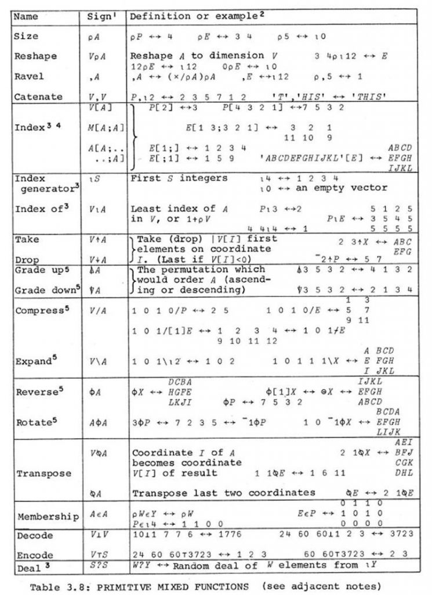

<!-- 
_class: front
_paginate: false
_footer: |
    
    
    
-->

# Fundamentos de programación en Python

## Módulo 1 :: Introducción a Python y a la programación :: Fundamentos de programación

Profesor: Saverio Trioni

> Convocatoria de 2023 de los Programas de formación profesional para el empleo, de
> especialidades de la oferta de formación no formal, para personas trabajadoras ocupadas,
> que promueve el Consorcio para la Formación Continua de Cataluña (ref. BDNS 709943)

---

<!--
_class: chapter-front
_paginate: false
header: Conceptos de computación
-->

# Conceptos de computación

---

## Qué es la computación

La computación es el estudio de los sistemas automatizados para el manejo de información. Involucra el diseño, desarrollo y aplicación de sistemas de computadoras y software.

El hardware se refiere a los componentes físicos de una computadora, como la CPU, la memoria y los dispositivos de entrada/salida. El software, por otro lado, es el conjunto de instrucciones que le dicen al hardware qué hacer.

Los lenguajes de programación son herramientas que usamos para escribir software. Existen muchos lenguajes, cada uno con sus propias ventajas, desventajas y usos ideales.

---

## Algoritmos y estructuras de datos

Un algoritmo es una serie de pasos para resolver un problema o realizar una tarea. En computación, los algoritmos son fundamentales para crear software eficiente y efectivo.

Las estructuras de datos son formas de organizar y almacenar datos para que puedan ser utilizados de manera eficiente. Algunas estructuras de datos comunes incluyen arrays, listas enlazadas, pilas, colas y árboles.

---

## Casos de uso de la computación

La computación tiene una amplia gama de aplicaciones en la vida cotidiana y en la industria. Algunos ejemplos incluyen:

- Sistemas de gestión de bases de datos
- Aplicaciones web y móviles
- Sistemas de inteligencia artificial y aprendizaje automático
- Juegos y entretenimiento
- Sistemas de control y automatización

---

<!--
_class: chapter-front
_paginate: false
header: Los orígenes de la programación
-->

# Los orígenes de la programación

---

## Telares Jacquard

El origen de los lenguajes de programación se remonta a los telares Jacquard en el siglo XIX. Estos telares utilizaban tarjetas perforadas para controlar los patrones de tejido, lo que puede considerarse como uno de los primeros ejemplos de programación.

Un único telar Jacquard podía producir una variedad de patrones complejos simplemente cambiando las tarjetas perforadas, lo que permitía una mayor flexibilidad y eficiencia en la producción de tejidos.

---

## Máquinas de Turing

En la década de 1930, Alan Turing desarrolló la idea que actualmente se conoce como "máquinas de Turing", que son modelos teóricos de computadoras capaces de realizar cualquier cálculo computacional. Estas máquinas sentaron las bases para el desarrollo de los lenguajes de programación modernos.

Las máquinas de Turing demostraron que cualquier problema computacional podía ser resuelto mediante un algoritmo, lo que llevó al desarrollo de lenguajes de programación para expresar estos algoritmos de manera clara y concisa.

---

## Lambda-cálculo

El lambda-cálculo, propuesto por Alonzo Church en la década de 1930, es un sistema formal para representar y manipular funciones. Es considerado uno de los fundamentos teóricos de la programación funcional y ha influido en el diseño de lenguajes como Lisp y Haskell.

El lambda-cálculo es un lenguaje simple pero poderoso que permite expresar cualquier cálculo computacional mediante la aplicación de funciones a argumentos.

---

<!--
_class: chapter-front
_paginate: false
header: Lenguajes de programación
-->

# Lenguajes de programación

---

## Lenguajes de programación importantes

A lo largo de la historia, han surgido varios lenguajes de programación importantes. Algunos ejemplos incluyen:

- FORTRAN: desarrollado en la década de 1950 para aplicaciones científicas y de ingeniería.
- C: creado en la década de 1970 y ampliamente utilizado en sistemas operativos y desarrollo de software de bajo nivel.
- Java: introducido en la década de 1990 y popularizado en el desarrollo de aplicaciones empresariales y web.
- Python: creado en la década de 1990, es un lenguaje de programación versátil y fácil de aprender.

---

## Lenguajes influyentes en la historia

Cada uno de estos lenguajes ha tenido un impacto significativo en la historia de la programación y ha contribuido al desarrollo de nuevos paradigmas y enfoques para resolver problemas computacionales.

- LISP: uno de los primeros lenguajes de programación de alto nivel y un pionero en la programación funcional. La potencia de LISP radica en su capacidad para manipular funciones como datos.

- Smalltalk: un lenguaje de programación orientado a objetos que influyó en el diseño de lenguajes modernos como Java y C#. Smalltalk introdujo conceptos como clases, objetos y herencia.

- Prolog: un lenguaje de programación lógica que se basa en la lógica matemática y la inferencia. Prolog es ampliamente utilizado en la inteligencia artificial y la programación de sistemas expertos. El prolog se usa también para diseñar nuevos lenguajes de programación.

---

<!--
_class: chapter-front
_paginate: false
header: Paradigmas de programación
-->

# Paradigmas de programación

---

Existen varios paradigmas de programación, cada uno con su enfoque y estilo de resolución de problemas. Algunos de los paradigmas más comunes son:

- Programación imperativa
- Programación orientada a objetos
- Programación funcional
- Programación lógica

---

## Ejemplos de programación imperativa

La programación imperativa se centra en la descripción de los pasos necesarios para resolver un problema. Los lenguajes de programación imperativa suelen utilizar variables, bucles y estructuras de control para manipular el estado del programa.

Ejemplos de lenguajes de programación con carácter preminentemente imperativo incluyen COBOL, C, Pascal y FORTRAN.

---

## Ejemplos de programación orientada a objetos

La programación orientada a objetos se basa en la idea de modelar el mundo real mediante la creación de objetos que interactúan entre sí. Los objetos encapsulan datos y comportamientos, lo que facilita la reutilización y la modularidad del código.

Ejemplos de lenguajes de programación orientada a objetos incluyen Java, C#, Python y Ruby.

---

## Ejemplos de programación funcional

La programación funcional se basa en el uso de funciones puras y la inmutabilidad de los datos. Los lenguajes de programación funcionales tratan las funciones como ciudadanos de primera clase y fomentan el uso de funciones de orden superior y la recursión.

Ejemplos de lenguajes de programación funcionales incluyen Haskell, Lisp, Scala y Clojure.

---

## Ejemplos de programación lógica

La programación lógica se basa en la lógica matemática y la inferencia. Los programas lógicos se definen mediante reglas lógicas y hechos, y el sistema de inferencia se encarga de deducir las respuestas a partir de estas reglas.

Ejemplos de lenguajes de programación lógica incluyen Prolog, Datalog y Mercury.

El SQL se puede considerar un lenguaje de programación lógica, ya que **describe** las consultas que se deben realizar, pero no **cómo** se deben realizar.

---

## Paradigmas vs lenguajes

Es importante tener en cuenta que un lenguaje de programación puede admitir varios paradigmas. Por ejemplo, Python es un lenguaje de programación que admite programación imperativa, orientada a objetos y funcional.

La elección del paradigma de programación adecuado depende del problema que se está resolviendo y de las preferencias del programador. Algunos problemas se pueden resolver de manera más eficiente y elegante utilizando un paradigma específico.

---

<!--
_class: chapter-front
_paginate: false
header: Introducción a Python
-->

# Q&A
