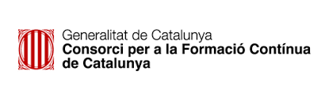

<!-- 
_class: front
_paginate: false
_footer: |
    
    
    
-->

# Fundamentos de programación en Python

## Módulo 1 :: Introducción a Python y a la programación :: El lenguaje Python

Profesor: Saverio Trioni

> Convocatoria de 2023 de los Programas de formación profesional para el empleo, de
> especialidades de la oferta de formación no formal, para personas trabajadoras ocupadas,
> que promueve el Consorcio para la Formación Continua de Cataluña (ref. BDNS 709943)

---

<!--
_class: chapter-front
_paginate: false
header: Origen
-->


# Origen

---

# Origen de Python

- Python fue creado por Guido van Rossum en 1989.
- Van Rossum quería un lenguaje de programación fácil de leer y usar.
- Python se lanzó al público en 1991.
- El nombre "Python" proviene de la serie de televisión británica "Monty Python's Flying Circus".
- Python es un lenguaje de programación de alto nivel, interpretado y de propósito general.

---

# Influencias

- Python toma prestadas características de otros lenguajes de programación.
- Algunas de las influencias más importantes son:
  - ABC
  - C
  - Modula-3
  - Perl
  - Java
  - Lisp
  - Haskell
- Python es un lenguaje de programación multiparadigma.

---

<!--
_class: chapter-front
_paginate: false
header: Sintaxis
-->


# Sintaxis

---

## Sintaxis de Python

- Python es un lenguaje de programación de alto nivel.
- La sintaxis de Python es simple y fácil de leer.

```py
print("Hola, mundo!")
```

```py
if x > 10:
    print("x es mayor que 10")
else:
    print("x es menor o igual a 10")
```

```py
map(lambda x: x ** 2, range(10))
```

---

## Literales

Python tiene varios tipos de literales.

Strings (cadena de caracteres):

```py
"Hello, world!"
```

Números:

```py
42
3.14
```

Booleanos:

```py
True
False
```

y más...

---

## Estructuras de datos

Python tiene varias estructuras de datos integradas.

Listas:

```py
[1, 2, 3, 4, 5]
```

Diccionarios:

```py
{"nombre": "Juan", "edad": 30}
```

y más...

---

## Bloques e indentación

Python utiliza la indentación para delimitar bloques de código.

Un bloque de código representa una serie de instrucciones que se consideran juntas.

```py
if x > 10:
    print("x es mayor que 10")
    print("¡Hurra!")
    if x > 20:
        print("x es también mayor que 20")
```

---

## Comentarios

Python permite comentarios en el código.

Los comentarios son útiles para documentar el código y explicar su funcionamiento.

```py
# Este es un comentario de una sola línea

"""
Este es un comentario de varias líneas.
Puede contener varias líneas de texto.
"""

print("Hola, mundo!")  # Este es otro comentario
```

---

<!--
_class: chapter-front
_paginate: false
header: Usos habituales de python: web, infraestructura, cálculo, IA 
-->


# Usos habituales de Python

---

## Usos habituales de Python: web

Python es ampliamente utilizado en el desarrollo web.

Gracias a frameworks como Django, Flask y FastAPI, Python es una excelente opción para crear aplicaciones web.

Con un framework web, el programador puede centrarse en la lógica de la aplicación y no en los detalles de bajo nivel.

---

## Ejemplo de aplicación web en Django

```py
# router

from django.urls import path
from . import views

urlpatterns = [
    path('', views.index, name='index'),
]
```

```py
# controller

from django.http import HttpResponse

def index(request):
    return HttpResponse("¡Hola, mundo!")
```

---

## Ejemplo de aplicación web en FastAPI

```py
from fastapi import FastAPI

app = FastAPI()

@app.get("/")
def read_root():
    return {"Hello": "World"}
```

---

## Usos habituales de Python: infraestructura

Python es ampliamente utilizado en la administración de sistemas y la automatización de tareas.

Con herramientas como Ansible, SaltStack y Fabric, Python es una excelente opción para gestionar la infraestructura de TI.

---

## Ejemplo de script de automatización

```py
import paramiko

client = paramiko.SSHClient()
client.set_missing_host_key_policy(paramiko.AutoAddPolicy())
client.connect('server', username='user', password='password')
client.exec_command('ls -l')
client.close()
```

---

## Usos habituales de Python: cálculo científico

Python es ampliamente utilizado en el cálculo científico y la ciencia de datos.

Con bibliotecas como NumPy, SciPy y Pandas, Python es una excelente opción para el análisis de datos y la modelización matemática.

En estos casos, Python se utiliza como un lenguaje de alto nivel para orquestar bibliotecas de bajo nivel escritas en C o FORTRAN. En cierta manera se puede considerar a Python como la interfaz de usuario de estas bibliotecas.

---

## Ejemplo de cálculo con NumPy

```py
import numpy as np
import numpy.linalg as la

a = np.matrix([[1, 2], [3, 4]])
b = np.matrix([[5, 6], [7, 8]])

la.det(np.matmul(a, b))
```

---

## Usos habituales de Python: inteligencia artificial

Python es ampliamente utilizado en la inteligencia artificial y el aprendizaje automático.

Con bibliotecas como TensorFlow, PyTorch y Scikit-learn, Python es una excelente opción para la creación de modelos de aprendizaje automático y la implementación de algoritmos de inteligencia artificial.

---

De la misma manera que en el cálculo científico, Python se utiliza como un lenguaje de alto nivel para orquestar bibliotecas de bajo nivel escritas en C o CUDA.

---

<!--
_class: chapter-front
_paginate: false
header: Patrones de programación
-->


# Patrones de programación

---

Los patrones de programación son soluciones a problemas comunes en el diseño de software.

Se puede considerar que un patrón es una especie de hábito que se puede aplicar a una situación específica.

Al ser Python aplicable a una multitud de casos de uso, es posible encontrar patrones de programación en diferentes áreas.

---

## Patrones de estilo

Python tiene un estilo de programación particular que se conoce como "Pythonic". El estilo Pythonic se basa en la simplicidad, la legibilidad y la elegancia del código.

Hay una serie de patrones de estilo que se consideran "Pythonic" y que se utilizan comúnmente en el desarrollo de software en Python.

Estos patrones se codifican en el PEP 8, que es la guía de estilo oficial de Python, y más recientemente con herramientas como `black` y `isort`, que implementan reglas más estrictas.

Usar un patrón de estilo prefijado ayuda a que el código sea más fácil de leer y mantener. Además elimina el esfuerzo de discutir sobre cómo se debería escribir el código.

---

## Patrones de diseño de software

Hay muchos patrones de diseño que se han desarrollado a lo largo de los años para resolver problemas comunes en la creación de software.

Algunos de los patrones no tienen sentido en Python, ya que el lenguaje ofrece características que permiten resolver los problemas de manera más sencilla.

Otros patrones siguen siendo muy útiles y se utilizan comúnmente en el desarrollo de software en Python.

La web <https://python-patterns.guide> es una excelente fuente de información sobre patrones de diseño en Python.

---

## Aspectos de Python para patrones

Python tiene dos características que ayudan a aplicar patrones de diseño de software:

- Los *dunder* (double-underscore), que son nombres especiales que se consideran *parte de una implementación*; no se usan directamente por el programador, sino que otros elementos del lenguaje los utilizan.

  Ejemplos de *dunder* son `__init__`, `__str__`, `__repr__`, `__call__`, `__enter__`, `__exit__`, etc.

- Los *decorators*, que son funciones que envuelven a otras funciones (u otras cosas) para modificar su comportamiento; su sintaxis se lee como una anotación de la cosa que se está decorando.

    Ejemplos de *decorators* son `@staticmethod`, `@classmethod`, `@property`, `@contextmanager`, `@asyncio.coroutine`, `@pytest.fixture`, etc.

---

<!--
_class: chapter-front
_paginate: false
header: Q&A
-->


# Q&A
