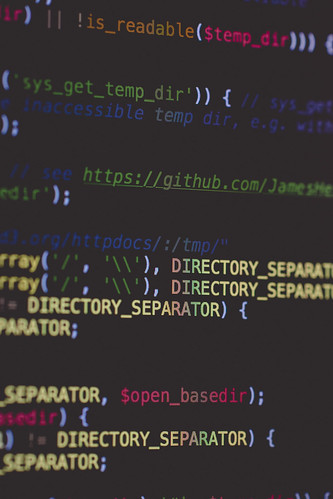
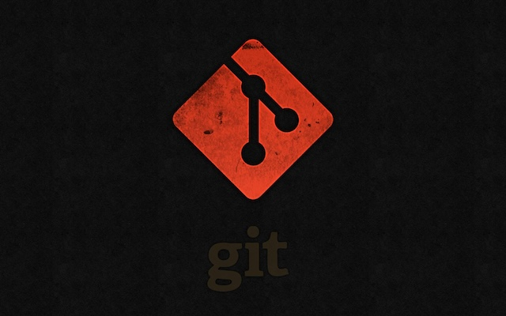

<!-- 
_class: front
_paginate: false
_footer: |
    
    
    
-->

# Fundamentos de programación en Python

## Módulo 1 :: Introducción a Python y a la programación :: Notebooks y otros entornos

Profesor: Saverio Trioni

> Convocatoria de 2023 de los Programas de formación profesional para el empleo, de
> especialidades de la oferta de formación no formal, para personas trabajadoras ocupadas,
> que promueve el Consorcio para la Formación Continua de Cataluña (ref. BDNS 709943)

---

<!--
_class: chapter-front
_paginate: false
header: Notebooks y Jupyter
-->

# Notebooks y Jupyter

---

## Qué es un notebook

Un notebook es un documento interactivo que combina código, texto, imágenes y otros elementos. Los notebooks son una forma popular de enseñar, aprender y hacer ciencia de datos.

Los notebooks se pueden ejecutar en un entorno de ejecución, como Jupyter, que permite ejecutar código en vivo y ver los resultados en tiempo real.

---

## Jupyter

Jupyter es un entorno de ejecución de notebooks que soporta varios lenguajes de programación, incluyendo Python, R y Julia.

Jupyter se puede instalar en una computadora o en la nube. También puedes usar Jupyter en Google Colab, que es un servicio gratuito de Google que te permite ejecutar notebooks en la nube.

**Práctica**: Abrid Jupyter desde el menú de Anaconda.

---

## Anaconda

Anaconda es una distribución de Python que incluye Jupyter y otros paquetes populares para la ciencia de datos. Anaconda es una forma fácil de instalar Python y sus paquetes en Windows, macOS y Linux.

Los ordenadores de la sala de informática tienen Anaconda instalado. Si estás usando tu propio ordenador, puedes descargar Anaconda desde <https://www.anaconda.com/products/distribution>.

---

<!--
_class: chapter-front
_paginate: false
header: Entornos de desarrollo
-->

# Entornos de desarrollo y ejecución

---

## Qué es un entorno de desarrollo

Un entorno de desarrollo es un conjunto de herramientas que te ayudan a escribir, probar y depurar código. Algunas de las herramientas más comunes en un entorno de desarrollo son:

- Un editor de código
- Un depurador
- Un compilador o intérprete

Jupyter es un entorno de desarrollo, pero también hay otros entornos de desarrollo que puedes usar para programar en Python, como Visual Studio Code, PyCharm y Spyder.

---

## Entornos de ejecución

Un entorno de ejecución es un sistema que ejecuta código. En Python, el intérprete de Python es el entorno de ejecución que ejecuta el código Python.

Cuando creamos una aplicación en python, sea un sistema web o un script de automatización, necesitaremos un destino sobre el cual ejecutar nuestro código.

El hecho que tal destino sea una máquina que tiene acceso privilegiado a cierta cantidad de datos hace que tengamos que prestar especial atención a la seguridad de nuestro código.

---

## Funciones como servicio

Una forma reciente de ejcutar código es mediante **funciones como servicio**. En este modelo, el código se ejecuta en un entorno sobre el cual no tenemos control, un proveedor de infraestructura se encarga de ejecutar nuestro código.

Ese es el model de servicios como AWS Lambda, Google Cloud Functions, Azure Functions, etc.

Si bien es muy cómodo de desplegar (ya que no tenemos que preocuparnos de servidores, redes etc.), es muy difícil de depurar, ya que no tenemos a nuestra disposición las herramientas que tenemos en un entorno de desarrollo.

---

## Entornos de desarrollo en la nube

Otra forma de programar en Python es usando un entorno de desarrollo en la nube. Algunos ejemplos de entornos de desarrollo en la nube son:

- GitHub Codespaces
- Cloud9

Estos entornos permiten programar y ejecutar el código directamente, sin necesidad
de instalar un enotrno de programación, y además el código ejecutado tiene "aspecto"
de ser desplegado ya en un entorno de producción.

---

<!--
_class: chapter-front
_paginate: false
header: Git
-->

Git: control de versiones

---

## Qué es Git

Git es un sistema de control de versiones que te permite rastrear los cambios en tu código y colaborar con otros programadores. Git es una herramienta esencial para cualquier programador, ya que te permite:

- Rastrear los cambios en tu código
- Colaborar con otros programadores
- Deshacer cambios
- Trabajar en diferentes versiones de tu código
- Mantener un historial de tu código
- Crear ramas para trabajar en nuevas funcionalidades
- Fusionar ramas para combinar cambios
- …

---

## Git online

Algunas empresas ofrecen una interfaz web para Git, que te permite trabajar con repositorios Git en la nube. Algunos ejemplos de plataformas de Git online son:

- GitHub
- GitLab
- Bitbucket
- …

Estas plataformas te permiten colaborar con otros programadores, rastrear los cambios en tu código y desplegar tu código en producción.

---

## Recursos adicionales sobre git

- Tutoriales: <https://www.atlassian.com/git/tutorials>

- Libro: <https://git-scm.com/book/en/v2>

- Guía rápida: <http://rogerdudler.github.io/git-guide/>

---

<!--
_class: chapter-front
_paginate: false
header: Q&A
-->

# Q&A
