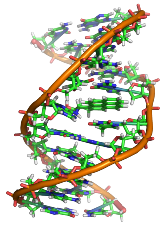
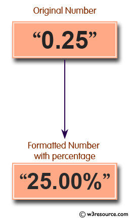
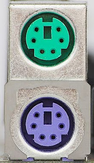

<!-- 
_class: front
_paginate: false
_footer: |
    
    
    
-->

# Fundamentos de programación en Python

## Módulo 1 :: Introducción a Python y a la programación :: Strings, formateo y I/O

Profesor: Saverio Trioni

> Convocatoria de 2023 de los Programas de formación profesional para el empleo, de
> especialidades de la oferta de formación no formal, para personas trabajadoras ocupadas,
> que promueve el Consorcio para la Formación Continua de Cataluña (ref. BDNS 709943)

---

<!--
_class: chapter-front
_paginate: false
header: Strings
-->


# Strings

---

## Introducción a Strings en Python

Los strings en Python son secuencias de caracteres. Se pueden crear utilizando comillas simples o dobles.

Los strings pueden contener cualquier carácter por ejemplo

```py
"Un texto con signos diacríticos"
'Un texto que contiene alguna "comilla doble"'
"Un texto con saltos de línea\ny \t tabuladores"
```

También pueden contener texto en cualquier idioma o símbolos reconocibles por Unicode.

```py
"Un texto con caracteres en griego: αβγδε"
"مرحبا" # Un texto en árabe
"こんにちは" # Un texto en japonés
"📒📕📗📘📙 🧑" # Emojis
```

---

Se pueden usar tres comillas dobles o simples para crear strings multilínea, y para incluir comillas simples o dobles en un string.

```py
"""Este es un string
que ocupa varias líneas
y puede contener "comillas dobles" y 'simples'"""
```

Los strings multilínea se utilizan también para documentar el código.

---

## Inmutabilidad de Strings

Los strings en Python son inmutables. Esto significa que una vez que un string es creado, no puede ser cambiado. Cualquier operación que parezca modificar un string en realidad crea un nuevo string.

```py
s = "Hola"
s[0] = "h" # Esto dará un error
```

Para modificar un string, debes crear un nuevo string con los cambios necesarios.

```py
s = "Hola"
s = "h" + s[1:] # Esto crea un nuevo string "hola"
```

---

## Funciones sobre Strings

Los strings en Python son secuencias, de manera que todas las operaciones que vimos sobre listas y tuplas también se pueden aplicar a strings.

```py
len("Hola")
"supercalifragilisticoespialidoso"[4:17]
"Ho " * 3 + "!!"
```

Además, Python proporciona una serie de funciones y métodos específicos para trabajar con strings.

```py
"Python".upper()
"Python".lower()
"python IS THE BEST PROGRAMMING LANGUAGE".capitalize()
"python IS THE BEST PROGRAMMING LANGUAGE".title()
```

---

## Funciones sobre Strings (cont.)

Hay muchas funciones que podemos aplicar a strings. Algunas de las más comunes son:

```py
s = "Python is the best programming language"
s.startswith("Python") # Verifica si el string empieza con "Python"
s.endswith("language") # Verifica si el string termina con "language"
s.find("best") # Devuelve la posición de la primera ocurrencia de "best"
s.count("a") # Cuenta cuántas veces aparece "a" en el string
s.strip() # Elimina los espacios en blanco al principio y al final del string
s.replace("Python", "Java").replace("best", "worst") # ... 🤷🏽
```

> Recordad siempre que no se modifica el string original, sino que se crea uno nuevo.

---

<!--
_class: chapter-front
_paginate: false
header: El problema de la codificación
-->



# El problema de la codificación

---

## La codificación

El texto es reconocible para nosotros como concepto, podemos escribir con diferentes formas, ligando o no cada letra, y el contenido sigue siendo el mismo.

Sin embargo para las máquinas no existe la capacidad de reconocer el texto (y no, la IA no es capaz de entender un texto como tal, simplemente aplica reglas estadísticas). Para una máquina solamente existen secuencias de ceros y unos, estados binarios de transistores.

Por lo tanto necesitamos una forma de representar el texto codificado. Un ejemplo de codificación (aunque no binario) es la codificación Morse, donde cada letra se representa con una secuencia de señales cortas y largas, y las letras se separan entre si por pausas.

---

## La codificación en informática

En informática se han desarrollado múltiples formas de codificar texto, todas ellas asocian una letra a uno o más bytes, y dependen de conocimiento externo por su interpretación.

Una de las formas más antiguas es la EBCDIC (Extended Binary Coded Decimal Interchange Code), que se utilizaba en los mainframes de IBM. En esta codificación la letra `A` se representa con el número 193, y el espacio con el número 240.

Más recientemente se desarrolla el estandard ASCII (American Standard Code for Information Interchange), que es una codificación de 7 bits que representa 128 caracteres, incluyendo letras, números y símbolos. En ASCII la letra `A` se representa con el número 65, y el espacio con el número 32.

El problema de estos dos sistemas es que no son suficientes para representar todos los caracteres de todos los idiomas. De hecho solamente dan soporte a texto en inglés.

---

## La explosión de la codificación

Para dar soporte a otros idiomas se inventaron diferentes maneras de aprovechar algunos "huecos" del código ASCII y los bytes de 128 a 255.

Por ejemplo, se creó la codificación ISO-8859-1, que añade los caracteres latinos:

| Carácter | Código |
|----------|--------|
| á        | 225    |

Y la codificación **Code page 437**, que añade los caracteres griegos y formas de dibujar tablas:

| Carácter | Código |
|----------|--------|
| Ω        | 234    |
| ┌        | 218    |
| ┬        | 194    |

---

## La explosión de la codificación (cont.)

El problema de tantas codificaciones es que no son compatibles entre sí. Si un texto está codificado en ISO-8859-1 y lo intentamos interpretar *sin saber la codificación de antemano*, tenemos pocas posibilidades de entender el texto correctamente.

Este problema sigue muy presente hoy en día, ya que los nombres de fichero guardados en un ordenador dependen de la configuración del sistema operativo, y si copiamos un fichero de un sistema a otro, es posible que los nombres de fichero no se muestren correctamente.

---

## Unicode

Para solucionar este problema se creó Unicode, que es un sistema de codificación de texto que asigna un número único a cada carácter de cualquier idioma. Unicode es un estándar internacional que permite a los ordenadores representar y manipular texto de cualquier idioma.

Para Unicode cada carácter se representa con un número entero, y se pueden representar más de 143,000 caracteres, incluyendo letras, números, símbolos y emojis.

A la hora de codificar un texto, se utiliza principalmente un sistema, llamado UTF-8, que es compatible con ASCII y que permite representar cualquier carácter Unicode.

---

## Unicode y Python

Antes de la versión 3 de Python, los strings se codificaban en ASCII por defecto, y había que tratar su condificación cada vez. Habían dos tipos de strings, `str` y `unicode`, y se podían convertir entre sí con los métodos `encode` y `decode`.

En Python 3, los strings son Unicode por defecto, y se pueden codificar en bytes con el método `encode` y decodificar con el método `decode`.

```py
"🧑".encode()
b'\xf0\x9f\xa7\x91'
```

---

<!--
_class: chapter-front
_paginate: false
header: Formateo de datos
-->



# Formateo de datos

---

## El formateo de datos

Cada vez que interactuamos con un REPL o en general con un programa, vemos su output de forma
legible, y no los bits y bytes que corresponden a lo que la computadora está haciendo.

Por ejemplo, el número 37 se representará posiblemente con los bits `00100101` entre otras cosas,
sin embargo para nosotros es más fácil de entender como `37`.

El formateo es la operación que transforma la representación interna de un dato en una representación
legible para los humanos.

---

## Formateo de datos en Python

En Python el formateo pasa por crear strings que corresponden a la representación de los datos.

Hay dos formas de formatear datos en Python: el formateo clásico usando la función `format`:

```py
"Hola, me llamo {} y tengo {} años".format(nombre, edad)
```

Y el formateo moderno usando f-strings:

```py
f"Hola, me llamo {nombre} y tengo {edad} años"
```

Los f-strings se resuelven en tiempo de ejecución, así que no es posible tener un f-string que dependa de una variable que no existe en ese momento. Por otro lado, las f-strings son más legibles y más fáciles de escribir.

---

## Opciones de formateo

Podemos especificar como queremos que se formatee un dato en un f-string. Por ejemplo, podemos especificar el número de decimales de un número flotante:

```py
f"El valor de pi es {pi:.2f}"
# El valor de pi es 3.14
```

O podemos especificar el número de caracteres de un string:

```py
f"El nombre de la ciudad es {ciudad:10}, que es muy bonita"
# El nombre de la ciudad es Barcelona   , que es muy bonita
```

---

## Funcionalidades específicas de la función `format`

En el caso del formateo *clásico*, tenemos a nuestra disposición una serie de opciones que podemos utilizar para formatear los datos.

Por ejemplo, podemos utilizar un índice para referirnos a un argumento concreto:

```py
template = "Hola, me llamo {1} y tengo {0} años"
template.format(30, 'Juan')
```

De esa manera podemos también reutilizar los argumentos en el template.

```py
template = "Hola, me llamo {1} y tengo {0} años, {1} es mi nombre"
template.format(30, 'Juan')
```

También podemos utilizar nombres para referirnos a los argumentos:

```py
template = "Hola, me llamo {nombre} y tengo {edad} años"
template.format(edad=30, nombre='Juan')
```

---

<!--
_class: chapter-front
_paginate: false
header: Entrada y salida de datos
-->



# Entrada y salida de datos

---

## Introducción a la Entrada/Salida en Python

I/O, o entrada/salida, se refiere a la comunicación entre un programa de computadora y el mundo exterior.

El mundo exterior puede ser un usuario que interactúa a través de una consola REPL, un sistema de archivos donde leemos y escribimos datos, o una red donde enviamos y recibimos información.

En Python, las operaciones de I/O se pueden realizar de varias maneras.

---

## Entrada de datos en Python

La función `input()` se utiliza para recoger la entrada del usuario. Esta función siempre devuelve una cadena.

```py
nombre = input("¿Cómo te llamas? ")
print(f"Hola, {nombre}!")
```

Si fuera necesario convertir la entrada a otro tipo, se puede hacer con las funciones `int()`, `float()`, etc.

```py
edad_input = input("¿Cuántos años tienes? ")
edad = int(edad_input)
```

---

## Salida de datos en Python

La función `print()` se utiliza para enviar la salida a la consola. Puede tomar cualquier número de argumentos y los imprime en la consola.

```py
print("Hola, mundo!")
print("El valor de pi es", 3.14159)
```

Para obtener el resultado de imprimir, es decir, el string que se ha impreso, se puede utilizar la función `str()`.

```py
str(3.14159)
# '3.14159'
```

---

## Salida de datos en Python (cont.)

La función `print` añade siempre un salto de línea al final de la salida. Si no queremos que se añada el salto de línea, podemos especificar el argumento `end`.

```py
print("Hola, mundo!", end="")
print("¡Adiós, mundo!")
```

También podemos especificar el separador entre los argumentos con el argumento `sep`.

```py
print("Hola", "mundo", sep=", ")
```

---

## Lectura y escritura de archivos en Python

Python proporciona funciones integradas para leer y escribir archivos. Las funciones `open()`, `read()`, `write()`, y `close()` son fundamentales para trabajar con archivos.

```py
f = open("archivo.txt", "r")
f.read()
f.close()
```

El segundo argumento de la función `open()` especifica el modo de apertura del archivo. Por ejemplo, "r" para leer, "w" para escribir - borrando todo lo que hubiera anteriormente, y "a" para añadir al final del archivo.

```py
f = open("archivo.txt", "w")
f.write("Hola, mundo!")
f.close()
```

Es fundamental cerrar el archivo después de haber terminado de trabajar con él, así aseguramos que todo lo que esté pendiente de escribir se escribe en el

---

<!--
_class: chapter-front
_paginate: false
header: Q&A
-->


# Q&A
