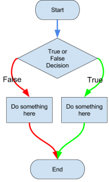

<!-- 
_class: front
_paginate: false
_footer: |
    
    
    
-->

# Fundamentos de programación en Python

## Módulo 2 :: Elementos de programación estructurada :: Condicionales

Profesor: Saverio Trioni

> Convocatoria de 2023 de los Programas de formación profesional para el empleo, de
> especialidades de la oferta de formación no formal, para personas trabajadoras ocupadas,
> que promueve el Consorcio para la Formación Continua de Cataluña (ref. BDNS 709943)

---

<!--
_class: chapter-front
_paginate: false
header: `if`
-->



# Condicionales y bloques

---

Como hemos visto en sesiones anteriores, la sintaxis de python se compone de bloques de código que se definen por la indentación. En esta sesión veremos cómo se ejecuta el código condicionalmente, es decir, cómo se ejecutan bloques de código si se cumple una condición.

Observamos los siguientes dos ejemplos:

```python
if x > 0:
    print("x es positivo")
```

En el primer ejemplo, la instrucción `print("x es positivo")` se ejecutará si `x` es mayor que 0.

```python
execute_if(x > 0, print("x es positivo"))
```

En el segundo ejemplo - aunque no sepamos qué hace `execute_if` -, la instrucción `print("x es positivo")` se ejecutará de todas maneras, porque los
argumentos de una función se evalúan antes de invocar a la función.

---

## Los bloques

Si un grupo de instrucciones tiene cierta indentación, mayor que la línea de código inmediatamente anterior, se considera un bloque de código.

El bloque de código, mientras sea sintáctimanente correcto, se ejecutará bajo el control de la línea anterior.

Los condicionales son el ejemplo más claro de bloques de código:

```python
if x > 0:
    print("x es positivo")
    print("¡Hurra!")
```

Si la línea anterior no termina en dos puntos, el código es incorrecto y Python lanzará un error.

Podemos decir que un bloque de código es *subordenado* a la línea anterior, o *controlado* por la línea anterior.

---

## Bloques vacíos

La sintaxis de Python es muy estricta, si algo necesita un bloque do código, aunque no haya nada que hacer, se debe poner un bloque vacío.

```python
if x > 0:
    pass
```

La keyword `pass` se puede usar en cualquier lugar donde se necesite un bloque de código, pero no se quiera hacer nada.

---

## El condicional `if`

La palabra `if` en Python es una palabra **reservada**, es decir, no se puede utilizar libremente, tiene un significado específico en el lenguaje.

Las palabras reservadas se conocen también como **keywords** o *palabras clave*.

La estructura de un fragmento de código con `if` es:

- La palabra clave `if`
- Una expresión, de la que se evalua su *valor de verdad* (truth value)
- Dos puntos `:`
- Un bloque de código indentado

Todos estos elementos son necesarios para que el fragmento de código sea correcto.

---

<!--
_class: chapter-front
_paginate: false
header: `else`
-->


# `else`, la alternativa

---

## El condicional `else`

A menudo tenemos dos comportamientos diferentes en función de si se cumple o no una condición.

En estos casos, podemos utilizar la palabra clave `else` para definir un bloque de código que se ejecutará si la condición no se cumple.

```python
if x > 0:
    print("x es positivo")
else:
    print("x no es positivo")
```

La keyword `else` no puede encontrarse sola, siempre debe ir precedida de un `if`.

---

## Estructura de un condicional con `else`

La estructura de un condicional con `else` es:

- La palabra clave `if`
- Una expresión, de la que se evalua su *valor de verdad* (truth value)
- Dos puntos `:`
- Un bloque de código indentado
- La palabra clave `else`
- Dos puntos `:`
- Un bloque de código indentado

---

## Más alternativas

Cuando haya más de dos alternativas, podemos utilizar la palabra clave `elif`, que es una contracción de `else if`.

```python
if x > 0:
    print("x es positivo")
elif x < 100:
    print("x es MUY negativo")
elif x < 0:
    print("x es negativo")
else:
    print("x es cero")
```

---

## Más alternativas sin `elif`

Si no tuvieramos `elif`, tendríamos que anidar condicionales:

```python
if x > 0:
    print("x es positivo")
else:
    if x < 100:
        print("x es MUY negativo")
    else:
        if x < 0:
            print("x es negativo")
        else:
            print("x es cero")
```

En este caso trivial se lee fácilmente, pero en casos más complejos, la anidación de condicionales puede ser muy confusa.

---

## `elif` sin `else`

La palabra clave `elif` puede utilizarse sin `else`, si no queremos hacer nada si no se cumple ninguna de las condiciones.

```python
if x > 0:
    print("x es positivo")
elif x < 0:
    print("x es negativo")
```

Sin embargo, igual que para el caso de `else`, `elif` debe ir precedida de un `if`.

---

## Y `switch`?

En muchos lenguajes existe una construcción más breve para casos en los que se quieren evaluar múltiples condiciones, como `switch` en C o Java, o `case` en Pascal.

Python no tiene tal construcción. Clásicamente se utilizan condicionales complejos (`if`, `elif`, `else`) u otras estructuras de datos no sintácticas, como diccionarios.

---

<!--
_class: chapter-front
_paginate: false
header: Combinación de condiciones
-->


# Combinación de condiciones

---

## Los operadores booleanos

En Python, como en muchos otros lenguajes, existen operadores que permiten combinar condiciones.

Los operadores booleanos son:

- `and`: devuelve verdadero si ambas condiciones son verdaderas
- `or`: devuelve verdadero si al menos una de las condiciones es verdadera
- `not`: devuelve `True` si la condición es falsa, `False` si la condición es verdadera

Hay unos valores booleanos específicos en Python: `True` y `False`. Sin embargo los operadores booleanos pueden ser aplicados a cualquier valor, no sólo a valores booleanos, y el valor resultante no tiene por qué ser un valor booleano.

---

## Valores de verdad

En Python, cualquier valor puede ser evaluado como verdadero o falso. Los booleanos `True` y `False` son claramente verdaderos y falsos, respectivamente.

Además:

- Los números `0`, `0.0`, `0j` son falsos, cualquier otro número es verdadero
- El string vacío `""` es falso, cualquier otro string es verdadero
- La lista vacía `[]`, el diccionario vacío `{}`, la tupla vacía `()` son todos falsos, cualquier estructura de ese tipo no vacía es verdadera
- El valor `None` es falso

En general podemos ver el valor de verdad de cualquier valor con la función `bool()`.

---

## Operadores booleanos como sintaxis de control

Las expresiones con operadores booleanos tienen la particularidad de obtener un valor lo más *pronto* posible. Es decir, si el valor a la izquierda de un `and` es falso, la expresión ignorará el valor a la derecha completamente, sin evaluarlo.

```python
x < 0 and print("x es negativo")
```

Sin embargo, se suele abusar de esta característica, y el código termina siendo confuso. El ejemplo anterior es mucho menos legible que las alternativas

```python
if x < 0:
    print("x es negativo")
```

o

```python
print("x es negativo") if x < 0 else None
```

---

<!--
_class: chapter-front
_paginate: false
header: El otro `if`
-->

# El otro `if`

---

## El operador ternario

En Python, como en muchos otros lenguajes, existe un operador que permite evaluar una condición en una sola línea.

```python
print("positivo" if 5 > 0 else "negativo")
```

Al contrario que en los otros lenguajes, en Python el operador ternario se expresa en palabras, utilizando `if` y `else`, en lugar de `?` y `:`.

Además la condición aparece en segundo lugar, en lugar de en primer lugar.

---

## El operador ternario (cont.)

Mientras la palabra clave `if` (y la correspondiente construcción) es una *instrucción*, así que tienen que empezar en una nueva línea y simplemente controla la ejecución de bloques de código, el operador ternario es una *expresión*, es decir, devuelve un valor.

```python
f'El número es {"positivo" if 5 > 0 else "negativo"}'
```

En este caso, la expresión `{"positivo" if 5 > 0 else "negativo"}` se evalúa a `"positivo"`, que es el valor que se sustituye en la cadena.

---

## Limitaciones del operador ternario

El operador ternario es muy útil para expresiones sencillas, pero no es adecuado para expresiones complejas.

Por la sintaxis muy estricta de Python, el operador ternario tiene que escribirse en una sola línea o agrupado por paréntesis. Condiciones muy complejas acaban siendo muy difícil de leer y entender.

Múltiples operadores ternarios anidados también son muy difíciles de leer y entender.

```py
print("positivo" if x > 0 else "negativo" if x < 0 else "cero")
```

En casos como este, es mejor utilizar un condicional completo.

```py
if x > 0:
    print("positivo")
elif x < 0:
    print("negativo")
else:
    print("cero")
```

---

<!--
_class: chapter-front
_paginate: false
header: Match
-->


# Match

---

## El operador `match`

En realidad, Python tiene una construcción más adecuada para verificar múltiples alternativas, similar al `switch` de otros lenguajes. Sin embargo esta construcción es relativamente nueva, y sólo está disponible a partir de la versión 3.10.

Vemos un caso sencillo:

```python
match x:
    case 0:
        print("x es cero")
    case 1:
        print("x es poco")
    case 2:
        print("x es mucho")
```

---

## Que es un `match`?

A primera vista, `match` parece un `switch` simplificado. Sin embargo, `match` va mucho más allá y permite verificar patrones estructurales en los valores.

Con `match` podemos:

- Verificar que el valor sea un literal específico (como en el slide anterior)
- Verificar que el valor sea una secuencia de 3 elementos
- Verificar que el segundo elemento de una secuencia sea un número mayor que 42
- Verificar que el valor sea un diccionario, en su clave `'foo'` haya un valor menor que 31.4
- …

---

## Ejemplo de `match`

Supongamos que `p` pueda representar un punto en un plano, como una tupla de dos coordenadas. Podemos ver en qué cuadrante está el punto con un `match`:

```python
match p:
    case (0, 0):
        print("Origen")
    case (0, y):
        print(f"Eje Y ({y})")
    case (x, 0):
        print(f"Eje X ({x})")
    case (x, y) if x > 0 and y > 0:
        print(f"Cuadrante I ({x}, {y})")
    case (x, y) if x < 0 and y > 0:
        print(f"Cuadrante II ({x}, {y})")
    case (x, y) if x < 0 and y < 0:
        print(f"Cuadrante III ({x}, {y})")
    case (_, _) as punto:
        print(f"Cuadrante IV ({punto})")
    case _:
        print("No es un punto")
```

---
<!--
_class: chapter-front
_paginate: false
header: Q&A
-->


# Q&A
