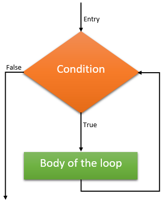
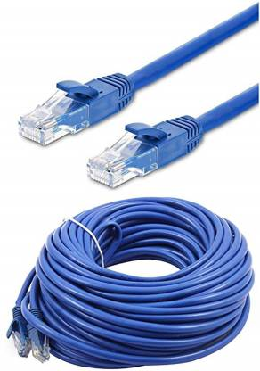

<!-- 
_class: front
_paginate: false
_footer: |
    
    
    
-->

# Fundamentos de programación en Python

## Módulo 2 :: Elementos de programación estructurada :: Bucles

Profesor: Saverio Trioni

> Convocatoria de 2023 de los Programas de formación profesional para el empleo, de
> especialidades de la oferta de formación no formal, para personas trabajadoras ocupadas,
> que promueve el Consorcio para la Formación Continua de Cataluña (ref. BDNS 709943)

---

<!--
_class: chapter-front
_paginate: false
header: while
-->



# `while`, el bucle condicional

---

##  Condiciones variables

Las expresiones en python pueden ser variables, es decir, pueden cambiar de valor en función de las circunstancias.

Un caso típico es una función aleatoria, que devuelve un valor diferente cada vez que se invoca:

```python
import random

random.random() # 0.018004655281522952
random.random() # 0.12345678901234567
random.random() # 0.9876543210987654
```

Otro caso de expresión variable es cuando usamos un identificador que puede ser
reasignado, o cuando usamos un valor mutable:

```python
array = [1, 2, 3]
len(array) # 3
array.append(4)
len(array) # 4
```

---

## Bucles condicionales

Si tenemos una expresion que puede cambiar de valor, podemos utilizar un bucle condicional para repetir una instrucción mientras la expresión sea verdadera.

```py
while random.random() > 0.5:
    print("¡Hurra!")
```

```py
while array:
    array.pop()
```

En el último ejemplo aprovechamos el hecho que una lista vacía es considerada falsa en Python.

---

## Salir de un bucle

En principio el bloque de un bucle `while` se ejecutará indefinidamente, hasta que la condición sea falsa.

Sin embargo, tenemos dos instrucciones que permiten controlar la ejecución del bloque:

- `break`: sale del bucle inmediatamente

```python
while True:
    if random.random() < 0.1:
        break
    print("¡Hurra!")
```

- `continue`: salta a la siguiente iteración del bucle

```python
while array:
    array.pop()
    if random.random() < 0.1:
        continue
    print("¡Hurra!")
```

---

## Al salir del bucle

En python existe además una instrucción que se ejecuta al salir de un bucle, siempre que el bucle haya terminado normalmente (y no ha sido interrumpido por un `break`).

```python
while array:
    if array.pop() == 0:
        print("he encontrado un cero")
        break
    print("paso a paso")
else:
    print("ya no queda nada en el array")
```

En cierta manera podemos ver este `else` como si fuera asociado a un `if` -- con la misma condición que el `while`.

---

<!--
_class: chapter-front
_paginate: false
header: for
-->



# `for`, el bucle de iteración

---

## Cosas iterables

En Python hay cosas (objetos) que se pueden *iterar* o *recorrer*. Algunas las hemos visto ya, como las listas, las tuplas, los diccionarios, los conjuntos.

Otra cosa que se puede iterar es un rango de números. La siguiente expresión tiene como valor el rango de números del 0 al 9:

```python
range(10)
```

La siguiente expresión tiene como valor los números **impares** del 5 al 90:

```python
range(5, 100, 2)
```

La siguiente expresión tiene como valor los números de 0 a 99999999999999999999. Claramente no es una lista - no nos cabría en la memoria.

```python
range(100000000000000000000)
```

---

## Recorrer cosas

Para recorrer una cosa, ejecutando un bloque a cada paso, utilizamos un bucle `for`:

```python
for i in range(10):
    print(i)
```

```python
for i in range(5, 100, 2):
    print(i)
```

Podemos recorrer también strings:

```python
for c in "Hola":
    print(c)
```

---

## Cosas que se consumen, y cosas que no se consumen

El concepto de iteración es muy usado para leer datos en entrada, por ejemplo de un socket de red.

El socket no es una cosa fija, sino que - para nuestro código - es una fuente de datos, que podemos consumir. Una vez consumido un dato, no podemos volver a leerlo.

```py
for data in socket:
    print(data)
```

Al contrario, un rango, un string o una lista son cosas que se pueden leer una y otra vez, sin perder acceso a los datos.

El modelo de iteración "por consumo" es tan fundamental que en realidad en Python todo se itera por consumo, aunque no sea evidente.

---

## Todo se consume en realidad

Cuando iteramos una cosa, Python - detrás de las cortinas - llama a una función especial, `iter()`, que convierte la cosa en un *iterador*.
Tal iterador se consume cuando iteramos sobre él, y se puede consumir una sola vez.

```python
iterador = iter(range(10))
for i in iterador:
    print(i)
for i in iterador:
    print(i)
```

En el segundo bucle no se imprime nada, porque el iterador ya ha sido consumido.
Si hubiéramos iterado el rango directamente, Python habría creado un nuevo iterador para nosotros.

```python
rango = range(10)
for i in rango:
    print(i)
for i in rango:
    print(i)
```

---

## Salir de un bucle `for`

En un bucle `for`, en principio salimos cuando el iterador se ha consumido completamente. Sin embargo podemos tener iteradores que no terminan nunca, o podemos querer salir antes de que se consuma completamente.

Igual que en un bucle `while`, podemos usar las instrucciones `break` y `continue` para controlar la ejecución del bucle.

```python
for i in range(10):
    if i == 5:
        break
    print(i)
```

Con `continue` podemos saltar a la siguiente iteración, sin ejecutar el resto del bloque:

```python
for i in range(10):
    if i % 2 == 0:
        continue
    print(i)
```

---

## Al salir del bucle `for`

Otra vez, igual que en un bucle `while`, podemos usar un `else` para ejecutar un bloque al salir del bucle, siempre que el bucle haya terminado normalmente.

Si se ha interrumpido con un `break`, el bloque no se ejecuta.

```python
for i in range(10):
    if i == 5:
        break
    print(i)
else:
    print("he terminado")
```

---

# Iteración de los diccionarios

Mientras la iteración sobre una lista o una tupla tiene un compaortamiento muy predecible, la iteración sobre un diccionario es más compleja.

- El orden de los elementos no está definido de antemano
- Los elementos iterados son solamente las claves

Si queremos iterar sobre los pares clave-valor, podemos hacerlo de la siguiente manera:

```python
for clave in diccionario:
    valor = diccionario[clave]
    print(clave, valor)
```

o bien usando el método `items()`:

```python
for clave, valor in diccionario.iteritems():
    print(clave, valor)
```

---

<!--
_class: chapter-front
_paginate: false
header: Q&A
-->


# Q&A
